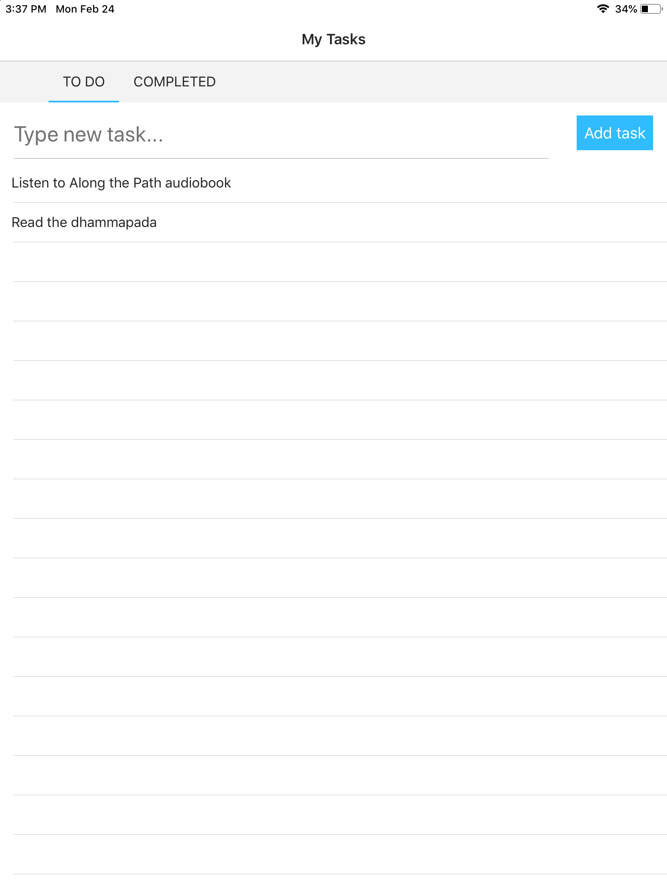
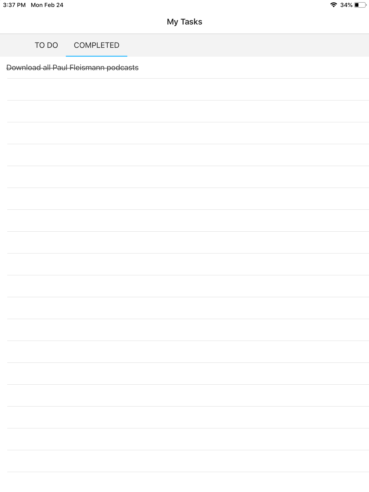

# Introduction

This spike is based on [Svelte Native](https://svelte-native.technology/).

# Try it out

Svelte-Native works on top of NativeScript which run on NativeScript *Playground* and *Preview* Apps during development

# Prerequisites

1. Install NativeScript:

```
npm install -g nativescript
```

Check that it's working by typing 'tns' which will open the Native Script CLI Help manual.
You can also check the version number.

```
tns
nativescript --version
```

2. Install NativeScript Playground and NativeScript Preview on your mobile devices for iOS and Android.

iOS: https://apps.apple.com/us/app/nativescript-playground/id1263543946?ls=1

Android: https://play.google.com/store/apps/details?id=org.nativescript.play


# Setup the app
Download the 'todoapp' directory, then within it, 'npm install'.

```
cd todoapp
npm install

```

# Running the app
NativeScript *Playground* and *Preview* will allow previewing on the mobile device.
```
tns preview --bundle
```

This will generate a QR code in the Command Line to scan with your mobile device's *Playground* app.  (You may be prompted on iOS to download NativeScript *Preview* if you haven't already.) This then starts the NativeScript *Preview* app on your mobile device and displays the app.  All changes you make in the Svelte Native code will update the mobile device Playground immediately.  The command line keeps a live console of all actions taken and errors when in *tns preview*.





# Stopping the App
```
ctrl + c
```


# Troubleshooting

## Failed install NativeScript on MacOS - 'tns' command line prompt returns 'command not found' after installing NativeScript.

```
sudo npm install -g nativescript
// then restart the terminal
```
```
// ...still not working then
npm config get prefix
// append 'bin' to the output and add this link to your bash profile
// example - export PATH=$PATH:/usr/local/Cellar/node/13.5.0/bin
```

# Docs

* Home page: https://svelte-native.technology/
* Svelte Native Quick Start: https://svelte-native.technology/blog/svelte-native-quick-start
* First App tutorial: https://svelte-native.technology/tutorial


# Notes
